# Multiplayer Online Tabletop RPG — Game Design Document

> **Design Philosophy:** Fast sessions (30–90 min), strategic depth, multiplayer fairness, and AI-enhanced immersion without AI-controlled gameplay decisions.

---

## 1. Core Gameplay Loop

The game follows a **Quest → Explore → Encounter → Resolve → Progress** loop that keeps sessions tight and rewarding.

```mermaid
flowchart LR
    A[🎯 Quest Briefing] --> B[🗺️ Grid Exploration]
    B --> C[⚔️ Encounter]
    C --> D[🎲 Resolution]
    D --> E{Encounter Complete?}
    E -->|No| C
    E -->|Yes| F[📈 Progress & Loot]
    F --> G{Quest Complete?}
    G -->|No| B
    G -->|Yes| H[🏆 Session Summary]
```



### Loop Phases

| Phase | Duration | Description |
|-------|----------|-------------|
| **Quest Briefing** | 2–5 min | AI narrates the objective; players see the map, threats, and win conditions |
| **Exploration** | 5–15 min | Players move on a grid, discover rooms/areas, trigger events |
| **Encounter** | 10–40 min | Turn-based combat or skill challenges against NPCs/environment |
| **Resolution** | 1–2 min | Dice determine outcomes; HP/resources update |
| **Progress** | 2–5 min | XP awarded, loot distributed, abilities unlocked |
| **Session Summary** | 2–3 min | AI generates narrative recap and stats highlights |

---

## 2. Turn Order & Turn Phases

### Initiative System

At the start of each encounter:

1. **Each player rolls 1d20 + Speed Modifier**
2. **NPCs roll as a group or individually** (server-controlled)
3. **Turn order = highest to lowest initiative**
4. **Ties:** Player beats NPC; between players, higher Speed Modifier wins; if still tied, random

> [!IMPORTANT]
> Server is authoritative for all dice rolls to prevent cheating.

### Turn Structure

Each player's turn has **3 sequential phases**:

```
┌─────────────────────────────────────────────────────────────────┐
│                        PLAYER TURN                              │
├──────────────┬────────────────────┬────────────────────────────┤
│  MOVE PHASE  │   ACTION PHASE     │   BONUS PHASE (Optional)   │
│   (Free)     │   (1 Action)       │   (1 Bonus Action)         │
├──────────────┼────────────────────┼────────────────────────────┤
│ Move up to   │ • Attack           │ • Use consumable item      │
│ Speed tiles  │ • Cast spell       │ • Quick ability            │
│              │ • Use object       │ • Defensive stance         │
│ Can split    │ • Help ally        │                            │
│ before/after │ • Dash (2× move)   │                            │
│ action       │ • Disengage        │                            │
│              │ • Examine          │                            │
└──────────────┴────────────────────┴────────────────────────────┘
```

### Turn Timer

| Game Mode | Turn Timer |
|-----------|------------|
| Casual | 60 seconds |
| Standard | 45 seconds |
| Competitive | 30 seconds |

*When timer expires:* Player auto-defends (no action, +2 AC until next turn).

---

## 3. Player Actions Per Turn

### Action Types

| Action Type | Examples | Cost |
|-------------|----------|------|
| **Move** | Walk, climb, swim | Free (up to Speed tiles) |
| **Standard Action** | Attack, Cast Spell, Use Object, Dash, Help, Examine | 1 per turn |
| **Bonus Action** | Quick abilities, consumables, defensive stance | 1 per turn (optional) |
| **Reaction** | Opportunity attack, counter-spell, block | 1 per round (triggered) |
| **Free Action** | Speak, drop item, minor interaction | Unlimited (reasonable) |

### Standard Actions Detailed

| Action | Effect | Dice Required |
|--------|--------|---------------|
| **Attack** | Make one weapon attack | 1d20 + ATK vs target AC |
| **Cast Spell** | Use a prepared spell (costs Mana/Slots) | Varies by spell |
| **Dash** | Move additional Speed tiles | None |
| **Disengage** | Move without provoking opportunity attacks | None |
| **Help** | Give ally advantage on next roll | None |
| **Examine** | Reveal enemy stats or hidden objects | 1d20 + Perception vs DC |
| **Use Object** | Activate item (potion, door, lever) | Varies by object |

### Reactions

| Reaction | Trigger | Effect |
|----------|---------|--------|
| **Opportunity Attack** | Enemy leaves your melee range | 1 free attack roll |
| **Block** | You're attacked (Shield required) | +2 AC for that attack |
| **Counter-Spell** | Enemy casts (if you have ability) | Contest roll to negate |

---

## 4. Dice System & Probability Balance

### Core Dice Mechanic

**d20 + Modifier vs Target Number (TN)**

| Roll Result | Outcome |
|-------------|---------|
| Natural 1 | **Critical Failure** — Auto-miss, trigger negative effect |
| Roll < TN | **Failure** — Action fails |
| Roll ≥ TN | **Success** — Action succeeds |
| Natural 20 | **Critical Success** — Auto-hit, double damage dice |

### Modifier Ranges

| Level Range | Typical Modifier | Expected Success vs AC 12 |
|-------------|------------------|---------------------------|
| 1–3 | +3 to +5 | 55–65% |
| 4–6 | +5 to +7 | 65–75% |
| 7–10 | +7 to +9 | 75–85% |

> [!TIP]
> Target ~60% base hit chance for engaging combat. Crits (5% each direction) add excitement.

### Damage Dice

| Weapon Tier | Damage Dice | Average |
|-------------|-------------|---------|
| Light | 1d6 | 3.5 |
| Standard | 1d8 | 4.5 |
| Heavy | 1d10 | 5.5 |
| Two-Handed | 2d6 | 7 |

### Saving Throws

When effects target players (traps, spells), they roll:

**1d20 + Relevant Stat Modifier vs Effect DC**

| DC | Difficulty | Design Use |
|----|------------|------------|
| 8 | Trivial | Tutorial, weak hazards |
| 10 | Easy | Minor traps, novice casters |
| 12 | Medium | Standard threats |
| 15 | Hard | Elite enemies, boss abilities |
| 18 | Very Hard | Legendary effects |

---

## 5. Combat Rules

### Hit Points (HP)

| Class Archetype | HP Formula | Example (Level 1, +2 CON) |
|-----------------|------------|---------------------------|
| Light (Rogue) | 6 + (Level × 4) + CON | 12 HP |
| Medium (Ranger) | 8 + (Level × 5) + CON | 15 HP |
| Heavy (Warrior) | 10 + (Level × 6) + CON | 18 HP |

### Damage Calculation

```
Final Damage = Weapon Dice + Strength/Dexterity Modifier + Bonus
```

**Critical Hits:** Roll damage dice twice, add modifiers once.

### Armor Class (AC)

```
AC = 10 + Armor Bonus + Dexterity Modifier (up to armor cap) + Shield
```

| Armor Type | AC Bonus | DEX Cap | Speed Penalty |
|------------|----------|---------|---------------|
| None | 0 | No cap | None |
| Light | +2 | +3 | None |
| Medium | +4 | +2 | None |
| Heavy | +6 | +0 | -1 Speed |

### Death & Dying

```mermaid
stateDiagram-v2
    [*] --> Healthy: HP > 0
    Healthy --> Wounded: HP ≤ 50%
    Wounded --> Downed: HP ≤ 0
    Downed --> DeathSave: Start of Turn
    DeathSave --> Stabilized: 3 Successes
    DeathSave --> Dead: 3 Failures
    Stabilized --> Healthy: Healing
    Downed --> Healthy: Healing ≥ 1 HP
    Dead --> [*]
```



**Death Saving Throws (Downed Players):**

| Roll | Result |
|------|--------|
| 1 | 2 Failures |
| 2–9 | 1 Failure |
| 10–19 | 1 Success |
| 20 | Regain 1 HP, wake up |

> **Ally Revival:** Allies can use an Action to stabilize a downed player (DC 10 check) or use a healing item.

### Session Death Handling

- **Respawn (Casual Mode):** Dead players return next encounter at 50% HP
- **Penalty (Standard Mode):** Dead players miss remainder of encounter, lose 25% session XP
- **Hardcore Mode:** Permanent death for session, new character for next session

---

## 6. Three Starter Character Classes

> [!NOTE]
> Classes are designed for clear roles, simple mechanics, and synergy in a 2–4 player party.

---

### ⚔️ WARRIOR (Tank/Melee DPS)

**Role:** Frontline fighter, absorbs damage, controls enemy positioning

| Stat | Base Value |
|------|------------|
| HP | 10 + (Level × 6) + CON |
| AC | 16 (Chain + Shield) |
| Speed | 4 tiles |
| Primary Stat | Strength |

**Core Abilities:**

| Ability | Type | Effect |
|---------|------|--------|
| **Power Strike** | Action | +2 damage on weapon attack |
| **Shield Bash** | Bonus | Push enemy 1 tile, they lose Reaction |
| **Taunt** | Bonus | 1 enemy must attack you for 1 round (DC 12 Will save) |
| **Defensive Stance** | Bonus | +2 AC, Speed reduced to 2 until next turn |
| **Opportunity Attack** | Reaction | Free attack when enemy leaves melee |

**Unique Passive — Hold the Line:** Enemies have -1 Speed in tiles adjacent to you.

---

### 🗡️ ROGUE (DPS/Utility)

**Role:** High burst damage, scouting, disabling traps and locks

| Stat | Base Value |
|------|------------|
| HP | 6 + (Level × 4) + CON |
| AC | 14 (Leather + DEX) |
| Speed | 5 tiles |
| Primary Stat | Dexterity |

**Core Abilities:**

| Ability | Type | Effect |
|---------|------|--------|
| **Sneak Attack** | Passive | +1d6 damage if ally is adjacent to target or you have advantage |
| **Backstab** | Action | Attack from behind: +2 ATK and Sneak Attack always applies |
| **Evasion** | Reaction | On DEX save success, take 0 damage (half on fail) |
| **Disarm Trap** | Action | DEX check to disable traps/locks (DC varies) |
| **Shadow Step** | Bonus | Teleport 2 tiles to unoccupied shadowed tile |

**Unique Passive — Cunning:** Can take Dash or Disengage as Bonus Action.

---

### ✨ MAGE (Ranged DPS/Support)

**Role:** Area damage, crowd control, utility spells

| Stat | Base Value |
|------|------------|
| HP | 6 + (Level × 4) + CON |
| AC | 11 (Robes + DEX) |
| Speed | 4 tiles |
| Primary Stat | Intelligence |
| Mana | 10 + (Level × 4) + INT |

**Core Abilities:**

| Ability | Type | Cost | Effect |
|---------|------|------|--------|
| **Arcane Bolt** | Action | 0 Mana | Ranged attack (6 tiles), 1d6 damage |
| **Fireball** | Action | 5 Mana | 2-tile radius, 2d6 fire, DEX save half |
| **Frost Nova** | Action | 3 Mana | Adjacent enemies: 1d6 cold + Speed -2 next turn |
| **Shield** | Reaction | 2 Mana | +4 AC against one attack |
| **Heal** | Action | 4 Mana | Ally regains 1d8 + INT HP (touch) |

**Unique Passive — Arcane Recovery:** Regain 2 Mana at start of each turn.

---

### Class Synergy Example (3-Player Party)

```mermaid
graph LR
    W[⚔️ Warrior] -->|Taunt draws aggro| E((Enemies))
    R[🗡️ Rogue] -->|Sneak Attack| E
    M[✨ Mage] -->|Fireball/Heal| E
    W -->|Hold the Line| R
    M -->|Heal| W
```



---

## 7. Progression System

### XP-Based Leveling

| Level | XP Required | Cumulative XP |
|-------|-------------|---------------|
| 1 | 0 | 0 |
| 2 | 100 | 100 |
| 3 | 200 | 300 |
| 4 | 350 | 650 |
| 5 | 500 | 1,150 |
| 6 | 700 | 1,850 |
| 7 | 900 | 2,750 |
| 8 | 1,200 | 3,950 |
| 9 | 1,500 | 5,450 |
| 10 | 2,000 | 7,450 |

**XP Sources:**

| Source | XP Range |
|--------|----------|
| Defeat minor enemy | 10–20 XP |
| Defeat elite enemy | 30–50 XP |
| Defeat boss | 100–200 XP |
| Complete quest objective | 50–100 XP |
| Discover secret | 20–40 XP |
| Roleplay bonus (AI awarded) | 5–15 XP |

### Level-Up Benefits

Each level grants:

1. **+1 to Primary Stat Modifier** (every 2 levels)
2. **HP Increase** (per class formula)
3. **New Ability or Ability Upgrade** (choice from 2–3 options)
4. **+1 Proficiency Bonus** (every 3 levels)

### Milestone System (Alternative)

For shorter campaigns, level up after:
- Completing a major quest chapter
- Surviving 3 session encounters
- Defeating a boss

### Loot System

| Loot Tier | Drop Rate | Power Level |
|-----------|-----------|-------------|
| Common | 40% | +1 to stat or minor effect |
| Uncommon | 30% | +2 or useful ability |
| Rare | 20% | +3 or strong ability |
| Epic | 8% | +4 or game-changing effect |
| Legendary | 2% | Unique named item, story significance |

> [!TIP]
> Distribute loot so all players get roughly equal value per session. Server tracks loot balance.

---

## 8. AI Assistance Design

> [!CAUTION]
> AI **never** makes gameplay decisions (dice rolls, attacks, movement). Players and server control all mechanics.

### AI Roles

| AI Role | Function | Trigger |
|---------|----------|---------|
| **Narrator** | Describes scenes, rooms, dramatic moments | Room entry, combat start/end |
| **NPC Voice** | Generates dialogue for NPCs | Player interacts with NPC |
| **Quest Guide** | Summarizes objectives, hints | Player requests hint |
| **Session Historian** | Creates end-of-session recap | Session ends |
| **Lore Keeper** | Answers world lore questions | Player asks about world |

### AI Interaction Examples

**Narration (Room Entry):**
```
AI: "The door creaks open, revealing a torch-lit chamber. Ancient tapestries 
hang in tatters. At the far end, a hulking figure raises its head—a 
scarred orc captain, flanked by two snarling wolves."
```

**NPC Dialogue:**
```
Player: "I approach the merchant and ask about the cursed sword."
AI (as Merchant): "Ah, that blade? Found it in the ruins of Thornhold. 
It hums when danger is near... but I've heard its wielders don't live 
long. 500 gold, and it's your problem."
```

**Session Recap:**
```
AI: "SESSION 3 COMPLETE — The party delved into the Shadowfen Caverns, 
defeated 12 goblins, and recovered the Moonstone Amulet. Kira the Rogue 
landed 3 critical strikes. Marcus the Warrior fell twice but was 
revived by Lyra's healing magic. Total XP: 340. MVP: Kira."
```

### AI Boundaries

| AI Does | AI Does NOT |
|---------|-------------|
| Describe environments | Move characters |
| Voice NPCs | Make NPC tactical decisions |
| Summarize events | Roll dice |
| Provide atmosphere | Grant items or XP (server does) |
| Hint at objectives | Make saving throws for players |

### AI Technical Implementation Notes

- **Context Window:** AI receives last 10 turns + room description + player names/classes
- **Personality Presets:** Serious/Epic, Light/Humorous, Dark/Gritty
- **Response Length:** 2–4 sentences for narration, 1–2 for NPC dialogue
- **Latency Target:** < 2 seconds for response generation

---

## 9. High-Quality & Replayability Factors

### What Makes It Feel High-Quality

| Factor | Implementation |
|--------|----------------|
| **Visual Feedback** | Dice roll animations, damage numbers, smooth token movement |
| **Sound Design** | Combat impacts, spell effects, ambient dungeon sounds |
| **Responsive UI** | < 100ms input response, clear turn indicators |
| **AI Narration** | Dynamic, non-repetitive descriptions |
| **Polish Details** | Death animations, loot sparkle, level-up fanfare |

### Replayability Drivers

| Driver | Description |
|--------|-------------|
| **Procedural Dungeons** | Server generates layouts from modular tiles |
| **Random Encounters** | Enemy composition varies each run |
| **Class Mastery** | Each class has 2–3 playstyle builds |
| **Loot Variety** | 50+ unique items at launch |
| **Challenge Modes** | Time trials, no-death runs, boss rush |
| **Season Pass / Events** | New quests, enemies, items monthly |
| **Leaderboards** | Fastest clears, highest damage, survival streaks |

### Session Variety


### Multiplayer Fairness

| System | Fairness Mechanism |
|--------|-------------------|
| **Loot** | Round-robin distribution + need/greed voting |
| **XP** | Shared equally among all participants |
| **Turn Time** | Enforced timer, auto-defend on timeout |
| **Disconnects** | AI takes over with defensive behavior until reconnect |
| **Late Join** | Player joins at party average level, basic gear |

---

## 10. Session Pacing Guide

### 30-Minute Session (Quick Play)

| Segment | Duration | Content |
|---------|----------|---------|
| Quest Briefing | 2 min | AI intro, simple objective |
| Exploration | 5 min | 3–4 rooms, 1 trap |
| Combat | 18 min | 2 encounters (easy + medium) |
| Summary | 5 min | Loot, XP, AI recap |

### 60-Minute Session (Standard)

| Segment | Duration | Content |
|---------|----------|---------|
| Quest Briefing | 3 min | AI intro, 2–3 objectives |
| Exploration | 10 min | 6–8 rooms, 2 traps, 1 puzzle |
| Combat | 35 min | 3–4 encounters + mini-boss |
| Summary | 12 min | Loot, XP, level-ups, AI recap |

### 90-Minute Session (Epic)

| Segment | Duration | Content |
|---------|----------|---------|
| Quest Briefing | 5 min | Complex story setup |
| Exploration | 20 min | Large dungeon, secrets, NPC talks |
| Combat | 55 min | 5+ encounters + boss fight |
| Summary | 10 min | Major loot, story progression |

---

## Appendix A: Quick Reference Tables

### Dice Probability (d20 + Modifier vs Target)

| Mod | AC 10 | AC 12 | AC 14 | AC 16 |
|-----|-------|-------|-------|-------|
| +3 | 70% | 60% | 50% | 40% |
| +5 | 80% | 70% | 60% | 50% |
| +7 | 90% | 80% | 70% | 60% |

### Status Effects

| Effect | Duration | Mechanical Impact |
|--------|----------|-------------------|
| **Stunned** | 1 turn | Lose all actions, AC -4 |
| **Slowed** | 2 turns | Speed halved |
| **Burning** | 3 turns | 1d4 fire damage/turn |
| **Poisoned** | 2 turns | -2 to all rolls |
| **Blessed** | 2 turns | +2 to all rolls |
| **Invisible** | Until attack | Enemies have disadvantage to hit |

### Action Economy Cheat Sheet

| You Can Do | Per Turn |
|------------|----------|
| Move up to Speed | ✅ |
| 1 Action | ✅ |
| 1 Bonus Action | ✅ (optional) |
| 1 Reaction | ✅ (per round, triggered) |
| Free Actions | Unlimited |

---

## Appendix B: Implementation Notes for Developers

### Server Authority
- All dice rolls happen server-side
- Client sends intent ("Attack Goblin A"), server validates and executes
- Anti-cheat: Client never calculates damage or HP changes

### Network Protocol
- Turn actions: Request-Response pattern
- AI narration: Async push after key events
- State sync: Delta updates after each turn

### Database Schema (High-Level)
- `sessions` — Active game sessions
- `players` — Player accounts, stats, inventory
- `characters` — Class, level, equipped items
- `encounters` — Current encounter state
- `audit_log` — All dice rolls and actions (for replays)

### AI Integration
- Separate service for AI generation
- Cache common narration snippets
- Fallback to pre-written text if AI latency > 3s

---

*Document Version: 1.0*  
*Designed for: 2–4 Player Multiplayer Sessions, 30–90 Minutes*
